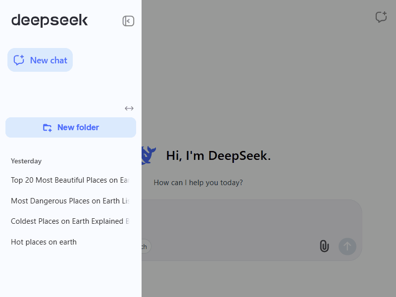

[](https://opensource.org/licenses/MIT)

# [Deepseek Chat Organizer](https://chromewebstore.google.com/detail/deepseek-chat-organizer/ajbfmjhmdhjoekmecolhelofdefepkdn?authuser=0&hl=ru)

Organize DeepSeek chat conversations into custom folders for easy navigation and management.

<br>
*▲ Core functionality in action*  

## 📖 Table of Contents

1. [Features](#-features)
2. [Installation](#-installation)
3. [Usage](#-usage)
4. [Technologies](#-technologies)
5. [License](#-license)

## ✨ Features

- 📂 Create folders to categorize chats
- 🔄 Data sync via `chrome.storage.sync`
- 🔍 Search by folders
- ↔️ Change the width of the sidebar for convenience

## ⚙️ Installation

### Chrome Web Store

[👉 Deepseek Chat Organizer](https://chromewebstore.google.com/detail/deepseek-chat-organizer/ajbfmjhmdhjoekmecolhelofdefepkdn?authuser=0&hl=ru)

### Manual Installation (Development)

```bash
# Clone repository
git clone https://github.com/expant/deepseek-chat-organizer.git
cd deepseek-chat-organizer

# Install dependencies
npm install

# Build extension
npm run build
```

Then:

1. Open Chrome and navigate to `chrome://extensions/`
2. Enable **Developer mode** (toggle in top-right)
3. Click **Load unpacked** and select the `dist/` folder

## 🖥️ Usage

1. Open DeepSeek Chat in your browser
2. Click the extension icon
3. Enable with the toggle button
4. Create folders, add chats using context menus

## 🔧 Technologies

- **Vite** - Build tool
- **Vue 3 (Composition API)** - Extension UI
- **Chrome API** – Storage and background processes

## 📜 License

This project is licensed under the [MIT License](LICENSE).
